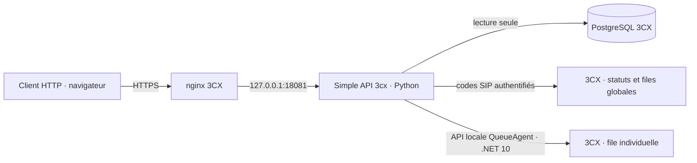

# Simple API 3cx

**Une passerelle REST auto-hébergée pour lire et piloter un 3CX v20 avec de simples URL HTTPS.** Elle expose les postes, leurs statuts, les connexions aux files d’attente et les statistiques des appels.

> [!IMPORTANT]
> Ce projet est indépendant de 3CX. Testé sur **Debian 12 et 3CX v20 PRO**. L’API REST Call Control officielle et la XAPI ne sont pas nécessaires aux fonctions présentées ici.

## Sommaire

- [Fonctions](#fonctions)
- [Architecture](#architecture)
- [Compatibilité et dépendances](#compatibilité-et-dépendances)
- [Installation](#installation)
- [Accès et sécurité](#accès-et-sécurité)
- [Référence de l’API](#référence-de-lapi)
- [Utiliser les URL](#utiliser-les-url)
- [Liens pour navigateur](#liens-pour-navigateur)
- [Administration](#administration)
- [Limites connues](#limites-connues)
- [Développement et licence](#développement-et-licence)

## Fonctions

**Chaque lecture correspond à une URL HTTPS en <code>GET</code> ; chaque modification à une URL HTTPS en <code>POST</code> ou à l’URL d’automatisation en <code>GET</code>.** Un client HTTP appelle ces URL avec une clé et depuis une IP autorisée. L’URL d’automatisation permet de changer le poste, la file et l’action sans créer un lien pour chaque combinaison.

| Domaine | Ce que permet l’URL de lecture | Ce que permet l’URL d’action |
| --- | --- | --- |
| **Postes** | Récupérer la liste, le nom, le profil actif et la connexion globale | Passer un poste en Disponible, Absent, Ne pas déranger ou dans un profil personnalisé |
| **Files d’attente** | Récupérer les files d’un poste, les agents et leurs connexions | Connecter ou déconnecter **une file précise** d’un poste, même s’il appartient à plusieurs files ; action globale également disponible |
| **Statistiques** | Récupérer par URL les appels reçus, traités, non traités et raccrochés, pour aujourd’hui, la semaine ou une période donnée | Aucune action sur les statistiques |
| **Administration** | Consulter les clés, IP autorisées et liens depuis la commande locale | Créer ou révoquer les clés et liens ; modifier les IP autorisées |

La connexion individuelle concerne un poste **déjà membre** d’une file. Elle ne change pas la liste des membres définie dans 3CX.

## Architecture

Le service lit PostgreSQL en **lecture seule**. Il change les profils et la connexion globale avec les codes SIP du PBX. Pour une file précise, un contrôleur C# utilise <code>QueueAgent.QueueStatus</code> dans la bibliothèque 3CX locale. **Aucune écriture directe dans les tables PostgreSQL du PBX.** Les actions sont confirmées par une nouvelle lecture de l’état.

## Compatibilité et dépendances

| Élément | Requis / fonctionnement |
| --- | --- |
| PBX | 3CX v20 auto-hébergé sur Debian, avec le compte système <code>phonesystem</code> |
| Installation testée | Debian 12 et 3CX v20 PRO |
| Outils | <code>bash</code>, <code>git</code>, <code>curl</code>, <code>python3</code>, <code>psql</code>, <code>nginx</code>, <code>systemd</code> ; <code>wget</code> pour la commande ci-dessous |
| Python | Bibliothèque standard uniquement : **aucun paquet pip** |
| .NET | SDK **.NET 10** téléchargé dans <code>/opt/simple-api-3cx/dotnet</code>, sans installation globale ; compilation contre la DLL 3CX locale |
| Réseau à l’installation | Accès à GitHub pour le dépôt et à Microsoft pour le SDK .NET lors de la première installation |
| Réseau à l’exécution | Application liée à <code>127.0.0.1:18081</code> ; nginx 3CX publie la route HTTPS |

Le SDK n’est téléchargé que s’il manque. L’installeur recompile le contrôleur contre **la DLL présente sur le serveur**. Les outils système du tableau doivent déjà être installés ; l’installeur n’exécute pas <code>apt</code>. Une évolution majeure de 3CX ou de .NET peut nécessiter une adaptation.

## Installation

Sur le serveur 3CX, avec un compte pouvant exécuter <code>sudo</code> :

~~~bash
wget -qO- https://raw.githubusercontent.com/TheLibertyWolf/simple-api-3cx/main/install.sh | sudo bash
~~~

L’installeur vérifie 3CX, récupère le dépôt, installe le SDK .NET privé, compile le contrôleur des files, copie l’application, crée le service systemd et ajoute la route HTTPS à nginx 3CX. Il sauvegarde la configuration nginx avant modification, exécute <code>nginx -t</code>, démarre le service et vérifie <code>/health</code>.

**Relancer l’installation met le code à jour sans supprimer les clés ni les IP autorisées.** Une mise à jour de 3CX peut régénérer le fichier nginx ; relancer l’installeur si la route disparaît.

| Emplacement | Contenu |
| --- | --- |
| <code>/opt/simple-api-3cx/</code> | Application Python, contrôleur des files et SDK .NET privé |
| <code>/var/lib/simple-api-3cx/config.json</code> | Configuration, empreintes des clés et liens, IP autorisées |
| <code>/etc/systemd/system/simple-api-3cx.service</code> | Service exécuté par <code>phonesystem</code> |
| <code>/usr/local/bin/simple-api-3cx</code> | Commande et menu d’administration |
| <code>/root/simple-api-3cx-credentials.txt</code> | Clé administrateur initiale, créée à la première installation |

Vérification :

~~~bash
systemctl is-active simple-api-3cx
curl -fsS 'https://<fqdn-3cx>/simple-api-3cx/v1/health'
~~~

<code>&lt;fqdn-3cx&gt;</code> désigne le domaine HTTPS du PBX. La route publique <code>/help</code> renvoie la liste des endpoints.

## Accès et sécurité

Les routes de données et d’action demandent **une IP autorisée et une clé API valide** dans l’en-tête <code>Authorization: Bearer &lt;clé&gt;</code>. La route d’automatisation utilise une clé spécifique dans l’URL et exige aussi une IP autorisée. Les routes <code>/health</code> et <code>/help</code> sont publiques. Par défaut, seules les IP locales <code>127.0.0.1</code> et <code>::1</code> sont autorisées.

| Droit | Accès |
| --- | --- |
| <code>read</code> | Lecture des postes, files et statistiques |
| <code>control</code> | Changement des statuts et des connexions aux files |
| <code>admin</code> | Lecture et actions ; à réserver à l’administration |

Une clé <code>control</code> seule **ne donne pas** le droit <code>read</code>. Créer une clé avec <code>read,control</code> pour un client qui lit et agit, ou avec <code>read</code> pour un client qui consulte seulement.

~~~bash
sudo simple-api-3cx allow add 203.0.113.10/32
sudo simple-api-3cx key create client-controle --scopes read,control
sudo simple-api-3cx key create client-lecture --scopes read
~~~

<code>203.0.113.10/32</code> est une adresse d’exemple : renseigner l’IP publique réelle de l’appelant. Les clés sont affichées **une seule fois**. Seule leur empreinte SHA-256 est conservée. Pour retirer un accès :

~~~bash
sudo simple-api-3cx allow remove 203.0.113.10/32
sudo simple-api-3cx key revoke client-controle
~~~

Les paramètres des URL ne sont pas journalisés par l’application et le journal d’accès de la route nginx est désactivé. Un lien navigateur ou d’automatisation contient néanmoins un secret dans l’URL : il peut rester dans l’historique ou être ouvert par un outil de prévisualisation. Traiter cette URL comme un mot de passe et révoquer la clé si elle est divulguée.

## Référence de l’API

URL de base : <code>https://&lt;fqdn-3cx&gt;/simple-api-3cx/v1</code>. Les requêtes <code>POST</code> utilisent <code>Content-Type: application/json</code>. Les réponses sont en JSON.

### Postes et statuts

| Méthode | Route | Résultat ou corps JSON |
| --- | --- | --- |
| <code>GET</code> | <code>/users</code> | Liste des postes, noms et profils actifs |
| <code>GET</code> | <code>/users/{poste}</code> | Profil et connexion globale d’un poste |
| <code>GET</code> | <code>/users/{poste}/queues</code> | Files dont le poste est membre et états de connexion |
| <code>POST</code> | <code>/users/{poste}/status</code> | <code>{"status":"available"}</code> ; autres valeurs : <code>away</code>, <code>dnd</code>, <code>custom1</code>, <code>custom2</code> |
| <code>POST</code> | <code>/users/{poste}/queues/global</code> | <code>{"logged_in":true}</code> ou <code>false</code> ; agit sur **toutes** les files du poste |

### Files d’attente

| Méthode | Route | Résultat ou corps JSON |
| --- | --- | --- |
| <code>GET</code> | <code>/queues</code> | Files et nombre d’agents membres |
| <code>GET</code> | <code>/queues/{file}/agents</code> | Agents de la file et états de connexion |
| <code>POST</code> | <code>/queues/{file}/agents/{poste}/login</code> | <code>{"logged_in":true}</code> ou <code>false</code> ; modifie **cette seule file** pour un membre existant |

Le <code>POST</code> individuel est **idempotent** : demander la valeur déjà enregistrée ne déclenche pas une deuxième modification. La réponse distingue <code>queue_logged_in</code> (réglage de cette file), <code>global_logged_in</code> (réglage du poste) et <code>effective_logged_in</code> (combinaison de ces réglages et de l’activation du poste).

### Statistiques

| Méthode | Route | Période |
| --- | --- | --- |
| <code>GET</code> | <code>/queues/{file}/stats?period=today</code> | Depuis aujourd’hui à 00:00, heure de Paris |
| <code>GET</code> | <code>/queues/{file}/stats?period=week</code> | Depuis lundi à 00:00, heure de Paris ; valeur par défaut |
| <code>GET</code> | <code>/queues/{file}/stats?from=...&to=...</code> | Dates ISO 8601 avec décalage horaire explicite ; maximum 366 jours |

Champs : <code>received</code> (reçus), <code>handled</code> (traités), <code>not_handled</code> (non traités) et <code>caller_hangups</code> (raccrochés par l’appelant). <code>not_handled</code> regroupe aussi l’attente maximale et l’absence d’agent : **ce n’est pas un synonyme exact d’« abandonnés par l’appelant »**.

### Codes HTTP

<code>200</code> succès · <code>400</code> données invalides · <code>401</code> clé ou lien invalide/expiré · <code>403</code> IP ou droit non autorisé · <code>404</code> route, poste ou appartenance introuvable · <code>502</code>/<code>504</code> lecture ou action 3CX non confirmée. Une erreur est renvoyée sous la forme <code>{"error":"…"}</code>.

## Utiliser les URL

Remplacer <code>&lt;fqdn-3cx&gt;</code>, <code>&lt;poste&gt;</code>, <code>&lt;file&gt;</code> et <code>&lt;cle-api&gt;</code> par les valeurs de votre installation. Les URL de lecture renvoient du JSON :

~~~text
GET https://<fqdn-3cx>/simple-api-3cx/v1/users/<poste>
GET https://<fqdn-3cx>/simple-api-3cx/v1/users/<poste>/queues
GET https://<fqdn-3cx>/simple-api-3cx/v1/queues/<file>/stats?period=week
~~~

Les URL d’action reçoivent un corps JSON en <code>POST</code> :

~~~text
POST https://<fqdn-3cx>/simple-api-3cx/v1/users/<poste>/status
     {"status":"available"}

POST https://<fqdn-3cx>/simple-api-3cx/v1/queues/<file>/agents/<poste>/login
     {"logged_in":false}
~~~

Dans ces exemples, la clé est transmise dans l’en-tête <code>Authorization: Bearer &lt;cle-api&gt;</code>. Une URL de lecture ou de <code>POST</code> ne se colle donc pas seule dans la barre d’adresse du navigateur. Pour **cliquer sur une URL et exécuter une action**, utiliser une URL d’automatisation ou un lien navigateur ci-dessous.

## URL d’automatisation paramétrable

Créer une seule clé pour piloter les statuts et la connexion individuelle aux files avec la même route <code>GET /automation</code> :

~~~bash
sudo simple-api-3cx automation create mon-client
~~~

La commande affiche le secret une seule fois. Remplacer <code>&lt;nom&gt;:&lt;secret&gt;</code> par la valeur obtenue ; seuls <code>poste</code>, <code>file</code> et <code>action</code> changent ensuite :

~~~text
https://<fqdn-3cx>/simple-api-3cx/v1/automation?poste=<poste>&action=<statut>&auth=<nom>:<secret>
https://<fqdn-3cx>/simple-api-3cx/v1/automation?poste=<poste>&file=<file>&action=<login|logout>&auth=<nom>:<secret>
~~~

Les statuts acceptés sont <code>available</code> (disponible), <code>away</code> (absent), <code>dnd</code> (ne pas déranger), <code>custom1</code> et <code>custom2</code>. Pour une file, <code>login</code> connecte et <code>logout</code> déconnecte **cette file uniquement**. Le poste doit déjà être membre de la file. L’URL fonctionne dans un navigateur ou avec <code>curl 'URL'</code> depuis une IP autorisée. Ouvrir l’URL déclenche immédiatement l’action ; une prévisualisation automatique peut aussi la déclencher. Révoquer avec <code>sudo simple-api-3cx automation revoke mon-client</code>.

## Liens pour navigateur

Un navigateur ne fournit pas facilement l’en-tête <code>Authorization</code>. La commande d’administration crée donc des URL **limitées à une action précise** :

| Type | Commande | Durée et accès |
| --- | --- | --- |
| Statut temporaire | <code>sudo simple-api-3cx url &lt;poste&gt; available --minutes 15</code> | Usage unique, 1 à 60 minutes ; le secret du ticket permet l’accès depuis toute IP |
| Statut permanent | <code>sudo simple-api-3cx link create &lt;nom&gt; &lt;poste&gt; available</code> | Jusqu’à révocation ; IP autorisée obligatoire |
| File permanente | <code>sudo simple-api-3cx queue-link &lt;nom&gt; &lt;file&gt; &lt;poste&gt; logout</code> | Jusqu’à révocation ; IP autorisée obligatoire |

Chaque commande affiche l’URL complète **une seule fois**. L’ouverture du lien exécute immédiatement l’action. Lister ou révoquer les liens permanents avec <code>sudo simple-api-3cx link list</code> et <code>sudo simple-api-3cx link revoke &lt;nom&gt;</code>. Pour une automatisation machine, préférer <code>POST</code> avec une clé API : elle ne figure alors pas dans l’URL.

## Administration

<code>sudo simple-api-3cx</code> ouvre le menu interactif. Quelques commandes utiles :

~~~bash
sudo simple-api-3cx key list
sudo simple-api-3cx allow list
sudo simple-api-3cx link list
sudo simple-api-3cx automation list
systemctl status simple-api-3cx
journalctl -u simple-api-3cx -n 100 --no-pager
~~~

La configuration est conservée dans <code>/var/lib/simple-api-3cx/config.json</code>. Ne pas la publier. Les secrets SIP des postes ne sont pas stockés dans ce fichier ; l’application les lit au moment d’exécuter un code SIP.

## Limites connues

- Installation vérifiée sur **3CX v20 PRO / Debian 12**. Les tables et fonctions de rapports internes à 3CX peuvent changer après une mise à jour du PBX.
- La connexion individuelle concerne seulement les **membres existants**. Une déconnexion globale ou un profil 3CX qui force la sortie des files peut empêcher la connexion individuelle de devenir active.
- <code>effective_logged_in</code> ne vérifie ni l’enregistrement d’un téléphone ni la disponibilité instantanée de l’agent. Il ne prend pas en compte toutes les règles de profil 3CX.
- Les codes SIP de statut et de connexion globale sont ceux configurés sur l’installation de référence (<code>*30</code> à <code>*34</code>, <code>*62</code>, <code>*63</code>). Vérifier les codes d’un autre PBX avant utilisation.
- Une régénération du fichier nginx par 3CX peut demander de relancer l’installeur.

## Développement et licence

L’API HTTP se trouve dans [simple_api_3cx.py](simple_api_3cx.py), le contrôleur individuel dans [queue_control/](queue_control/), l’installeur dans [install.sh](install.sh). Voir [CONTRIBUTING.md](CONTRIBUTING.md) pour contribuer, [CHANGELOG.md](CHANGELOG.md) pour les changements et [SECURITY.md](SECURITY.md) pour signaler un problème de sécurité.

~~~bash
python3 -m py_compile simple_api_3cx.py
python3 -m unittest discover -s tests -v
bash -n install.sh
sh -n scripts/simple-api-3cx
~~~

La compilation C# demande le SDK .NET 10 **et** la DLL 3CX installée sur un PBX compatible. La CI GitHub vérifie Python et les scripts shell ; les essais de la bibliothèque 3CX et des actions réelles demandent un PBX de test.

Code publié sous [licence MIT](LICENSE). 3CX et ses bibliothèques restent soumis à leurs propres conditions.

Documentation 3CX : [gestion des files](https://www.3cx.com/docs/pbx-queue-status/), [codes de numérotation](https://www.3cx.com/docs/pbx-dial-codes/), [API locale Linux](https://www.3cx.com/docs/call-api-linux/), [rapports](https://www.3cx.com/docs/manual/call-reports/).
